# Recharge - product biography

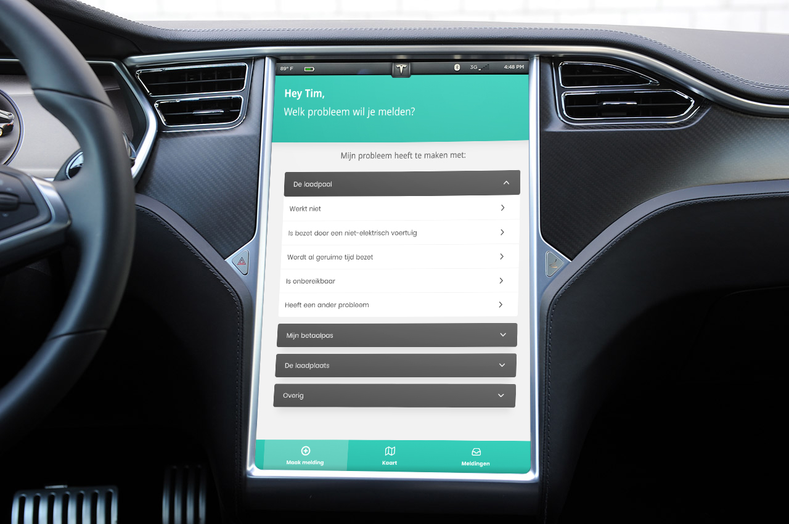

---

## Summary
This document provides an insight into the development of an interactive proof of concept for an application that allows users of charging stations in Amsterdam to report problems that occur when trying to charge their electric car.

---

## Table of contents
- [Introduction](#introduction)
- [Learning goals](#learning-goals)
- [The team](#the-team)
- [Week 1: first meeting and concepting phase](#week-1-first-meeting-and-concepting-phase)
    - [Concepting phase](#concepting-phase)
- [Week 2: Design phase](#week-2-design-phase)
    - [Design phase](design-phase)
- [Week 3: Frontend setup](#week-3-frontend-setup)
    - [Code example](#code-example)
    - [Github](#github)
    - [Features made in this week](#features-made-in-this-week)
- [Week 4: More development](#week-4-more-development)
- [Week 5: Wrapping up](#week-5-wrapping-up)
    - [Lighthouse audit](#lighthouse-audit)
- [Personal reflection](#personal-reflection)
- [Contributors](#contributors)

---

## Introduction
This project was initiated by Jurjen Helmus from IDOLaad. The idea stems from the desire to gain more insights in the amount of times people try to charge their electric vehicle at a charging station, but fail to. This data would be valuable to accurately predict the amount of charging stations needed in Amsterdam by 2030 to meet the demand.

---

## Learning goals
Legend, goals met according to myself:   

| Icon | Definition |
|------|------------|
|✔️| Succeeded |
|🔸| Partially succeeded |
|❌| Failed |


- **Web app from scratch**
    - Give user feedback at the right moment ✔️
        - Microinteractions ✔️
        - Showing sate ✔️
        - Empty states ✔️


- **Performance matters**
    - Application works (partially) offline and thus gives an 'instant' feeling to the user 🔸
        - Writing a serviceworker 🔸


- **Web design**
    - Utilizing the exclusive design principles 🔸
        - Right contrast, accessible to all users ✔️


- **Real Time Web**
    - Real time connections and multi-user support ✔️
        - When status updates notify users and other stakeholders ✔️

---

## The team
- [Tim Ruiterkamp](https://github.com/timruiterkamp): focus on backend
- [Dennis Wegereef](https://github.com/denniswegereef): focus on design & frontend
- [Folkert-Jan van der Pol](https://github.com/follywolly): focus on design & frontend

---

## Week 1: first meeting and concepting phase
We kicked off the first week by meeting with our client, Jurjen Helmus. He explained the problem that needed to be solved and the scope of the project.
He's coordinator of the minor data-science and teammember of the [IDOLaad project](http://www.idolaad.nl/). He's researching the charging stations in Amsterdam and is trying to accurately predict the amount of charging stations necessary to meet demand in 2030.

He presented us his wish to develop an app which allows users of charging stations to submit their issues with specific charging stations, so people experiencing frustration with the charging stations get a feeling of being heard.

After this meeting we immedeatly started the concepting phase of this project.

### Concepting phase
We kicked off the concepting phase by organizing a brainstorm. We determined the stakeholders and wrote down a word-web related to those stakeholders.

The result can be found down below:

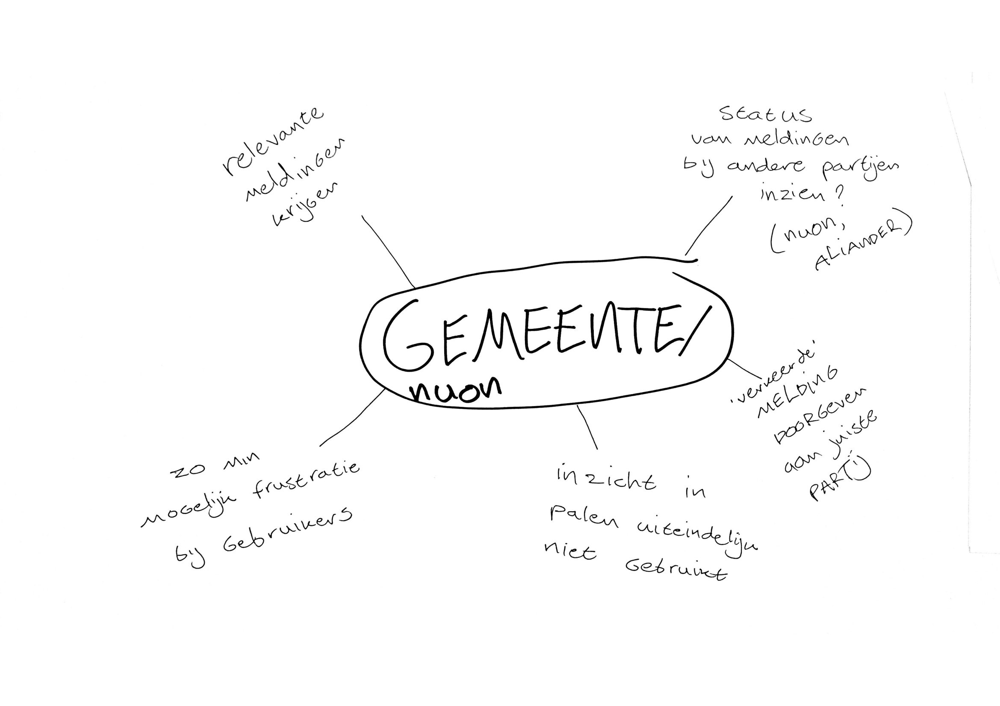
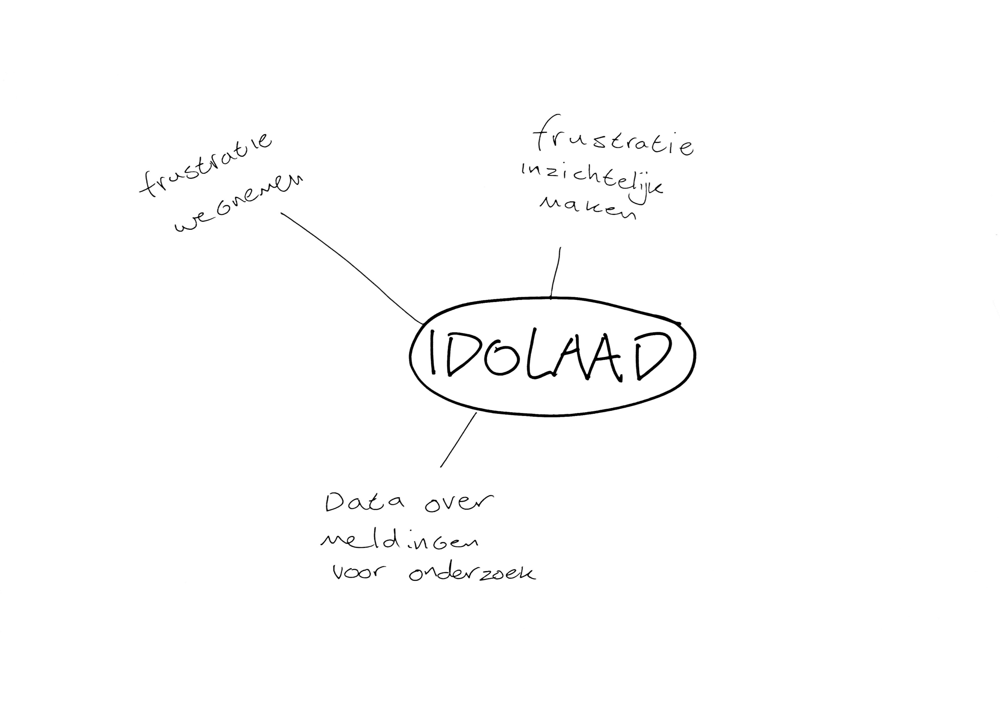
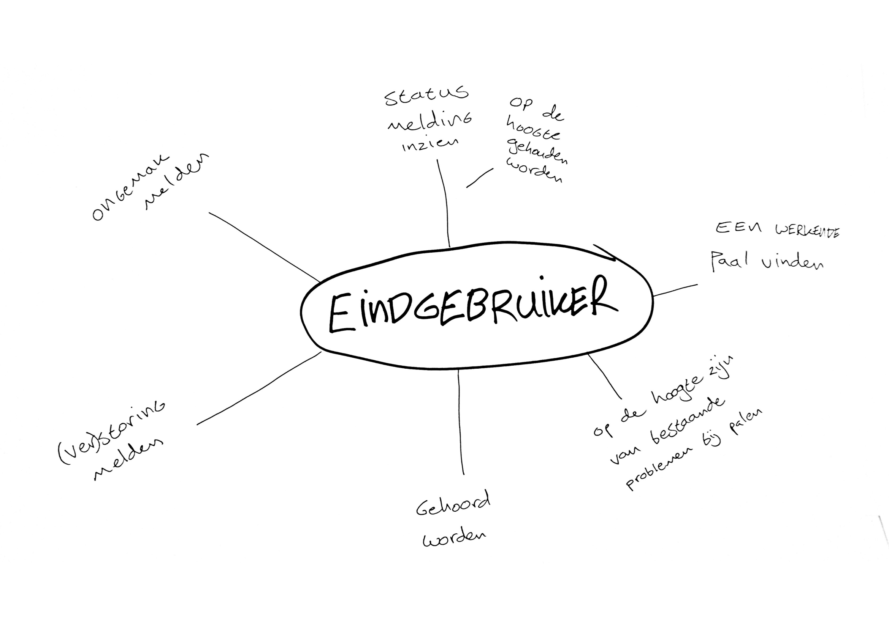

Based on the wishes from the wordwebs we drafted a featurelist:

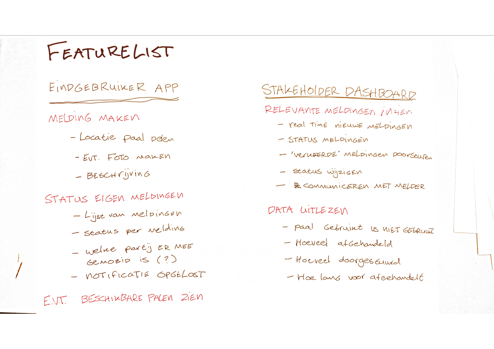
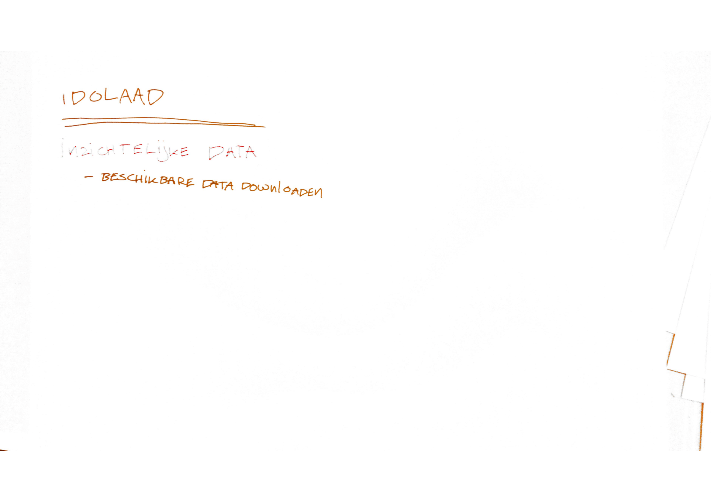

Based on this featurelist we started the development of a low-fi wireframe prototype.

#### Protoype
Dennis and I started right away with the wireframes for the application while Tim started setting up the project and the API.
We were trying to translate the wishes of the different stakeholders into wireframes for an application.

[link to client side of project](https://xd.adobe.com/view/200df57a-f938-47e7-62e4-16f374a24c3d-563c/)
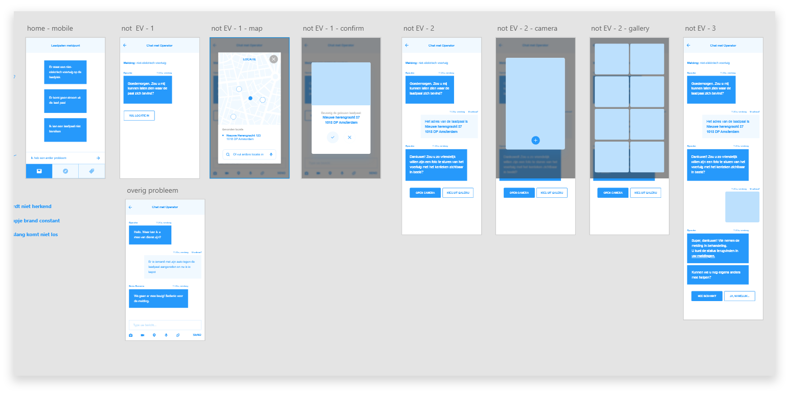

[link to dashboard of project](https://xd.adobe.com/view/888c5771-e21d-4561-4026-ab89433b5c9d-febd/)
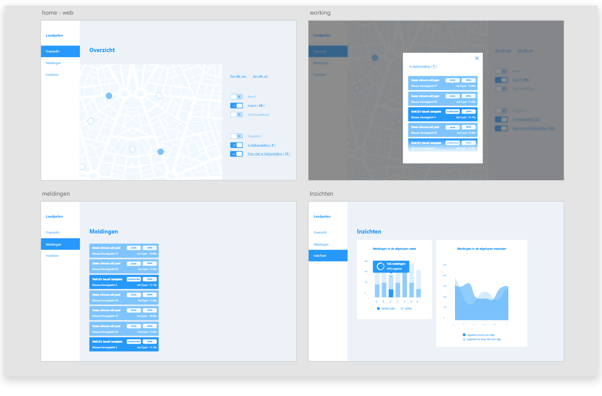

---

## Week 2: Design phase
This week we met with Jurjen again. He was really impressed with the ideas we had for the application and the flow we implemented. The only feedback he had was that some text content was wrong and he was excited to see what we would come up with in the design phase.

### Design phase
After the successful meeting with Jurjen, Dennis and I started the design phase of the project, while Tim continued setting up the server and database structure.

We started by exploring possiblities in designs for screens based on the wireframes:

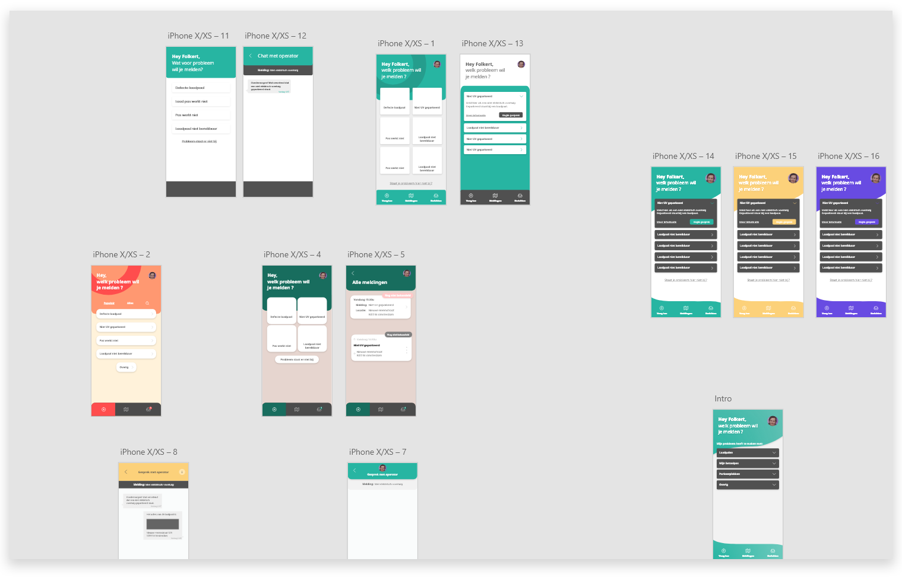

Relatively quickly we decided to choose green as our primary color since it's associated with green energy, which relates to the charging stations.

We added blue as a secondary color and red for situations where attention was required.
Based on these values, we found some clean fonts to re-enforce the feeling of modern progression and drafted a style guide  (ignore the logo for now, that came later):

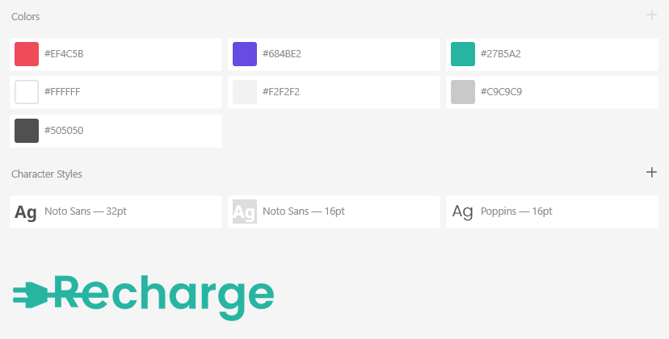

Based on this styleguide we started filling in the wireframes with the appropriate styles:

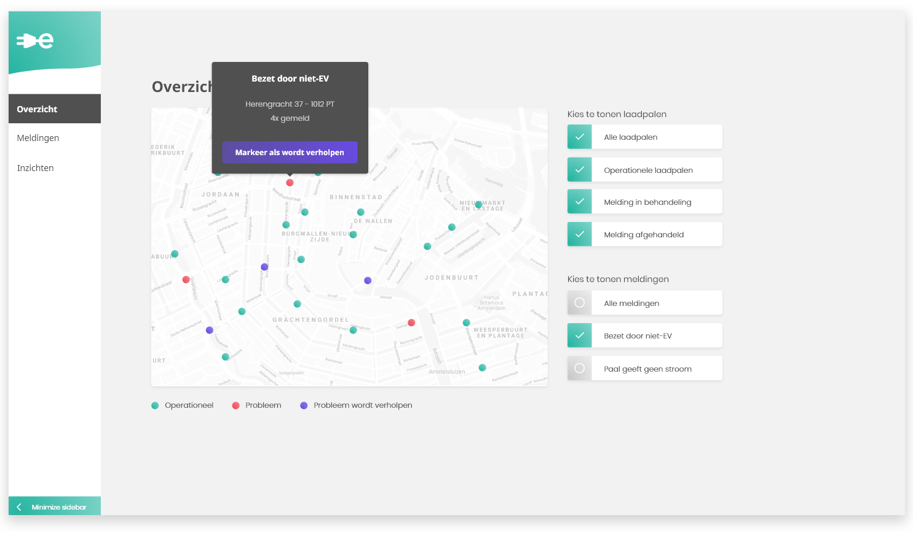


## Week 3: Frontend setup
This week Dennis and I started setting up the frontend part of the application structure. For the stack we had a few requirements:
- Quick to prototype
- Support server side rendering (performance)
- Easily deployable
- Component based for maintenance

We found two big options, namely Next (react based) and Nuxt (vue based). We chose the latter, since we were familiar with Vue syntax already which would help us prototype more quickly.

We made the project structure component based. We setup every little piece of code we could divide up in different pieces as components. This way we could work separately on different functionalities without getting in the way of each other.

### Code example
Below you'll find a little module I wrote to help us not write the same code over and over again.
It sets up a POST request to the API.

```js
const DB = {
  execute(query, auth) { // accepts a GraphQL query and authentication token
    const env = // live prototype or localhost
      process.env.NODE_ENV == 'development'
        ? process.env.DEV_URL
        : process.env.PROD_URL

    return fetch(env + '/graphql', {
      method: 'POST',
      headers: {
        'Content-Type': 'application/json',
        Authorization: 'Bearer ' + auth // setup the authorization headers
      },
      body: JSON.stringify({
        query
      })
    })
      .then(res => res.json())
      .then(res => res.data)
      .catch(console.error)
  }
}

export default DB
```
We utilize it like this:

```js
import DB from '~/helpers/db.js'

// ... //

DB.execute(
  'query { issues { _id }}', // GraphQL query string
  this.$store.getters.GET_TOKEN // return JSON Webtoken from store
)
.then(res => console.log(res.issues))

// expected output
[{_id: 'string'},{_id: 'string'},{_id: 'string'},{_id: 'string'}]
```

### Github
We worked on seperate branches for each feature. When a feature was done, we opened pull requests on the master and started the merging process. Because of this tactic combined with the component based structure we didn't have a lot of problems working together on the project. In 200 commits we have had maybe 5 merge conflicts.
We made use of GitKraken to ease and speed up the process.

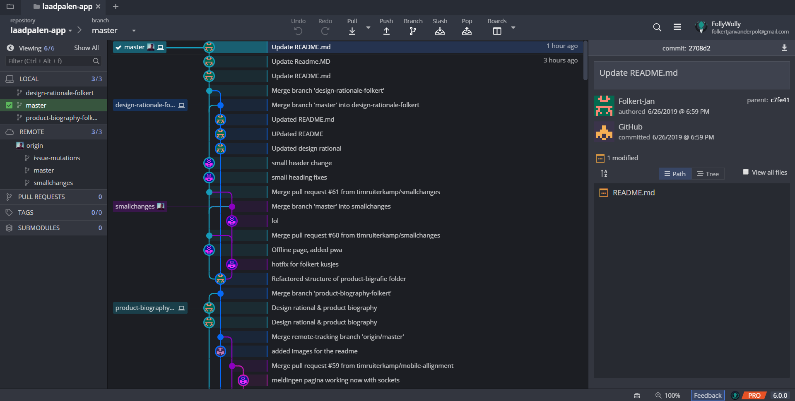

### Features made in this week
***Charging stations map component (Atlas.vue)***

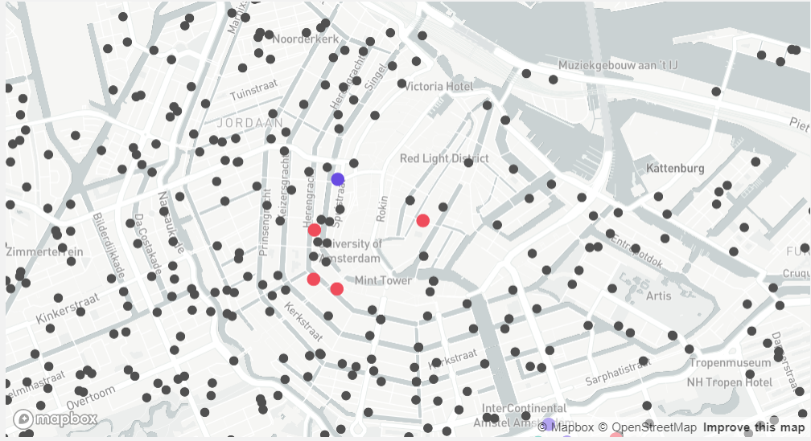

***Toggle***

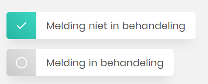

*** Card ***

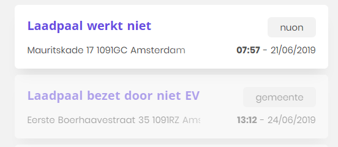

*** Chat flow ***

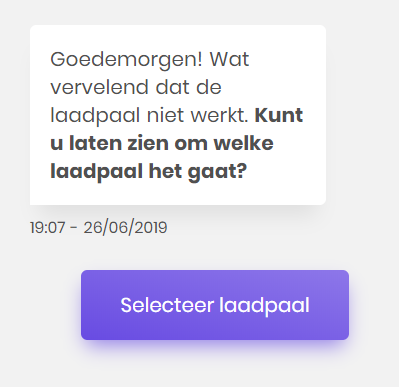

*** Tooltip ***

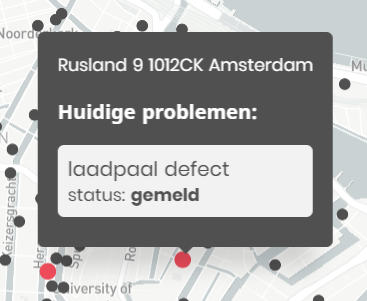

---

## Week 4: More development
In this week I optimized the components I made last week and linked them to the API created by Tim. I also added the charging stations to the database.
It was quite difficult to get into the structure already set up by Tim since it was written in typescript and makes use of GraphQL, both new technologies for me.

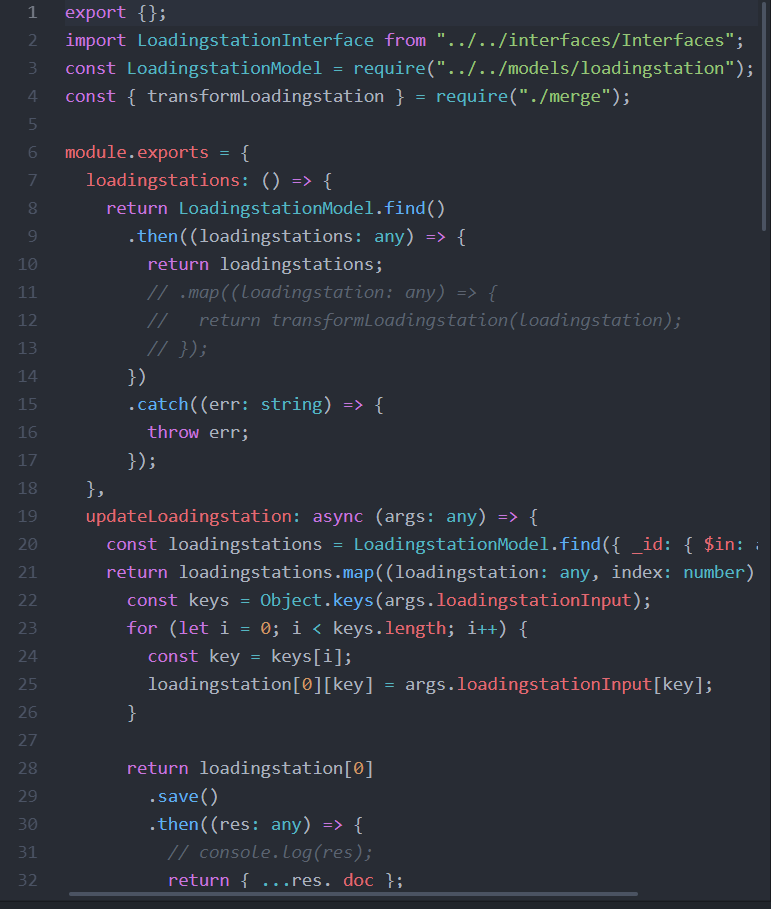

This week I also updated the notification component that Tim and Dennis made. I updated the styles and added some data to the Socket controlling the notification.

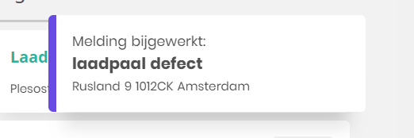

I also made sure the status of issues in the database updates whenever you drag an issue from one list to another:

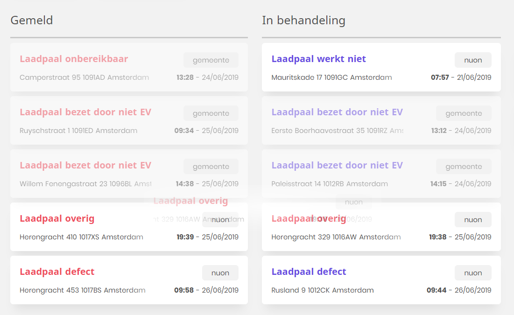

---

## Week 5: Wrapping up

This week I spend most my time writing the [design rational](https://github.com/timruiterkamp/laadpalen-app/blob/master/README.md) of the project and did a lot of bugfixing. Minor styling fixes, little edge cases we didn't took notice of before etc.

I also made the prototype introduction page, which quickly summarizes the project and the features it has, and allows you to setup some variables to personalize your experience.

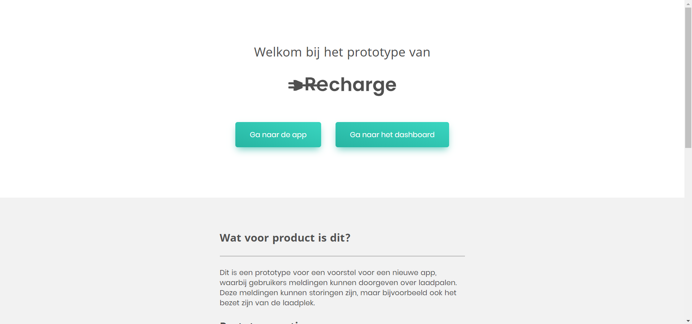

In the last few days we also started turning the project into a progressive web app to support offline use.

Since the project was made using Nuxt, it was pretty difficult to add offline support. We added a module called @nuxt/pwa to help us out. This helped massively with making offline support possible. The only thing not working offline currently is the issue list with issues submitted by the user.

Tim also performed some accesibility audits, which resulted in us updating the colors and the html elements our webapp consisted of. This massively improved the accesibility.

### Lighthouse audit
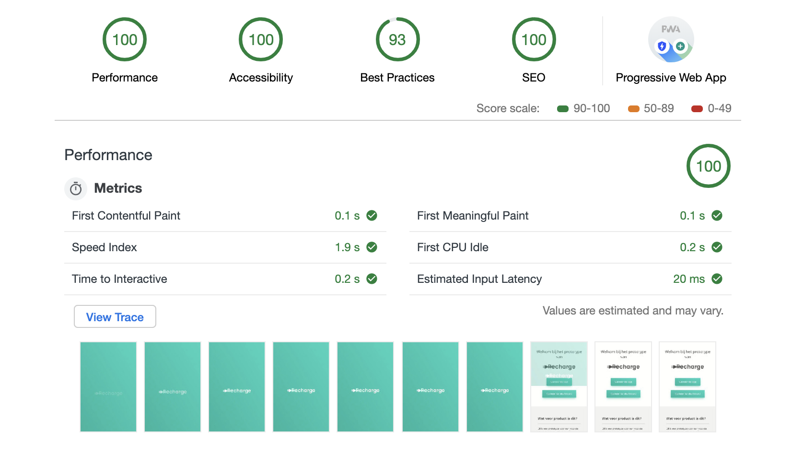

---

## Personal reflection
Personal reflection on the process and teamwork can be found [here](reflection.md)

---

## Contributors
- [Tim Ruiterkamp](https://github.com/timruiterkamp)
- [Dennis Wegereef](https://github.com/denniswegereef)
- [Folkert-Jan van der Pol](https://github.com/follywolly)
